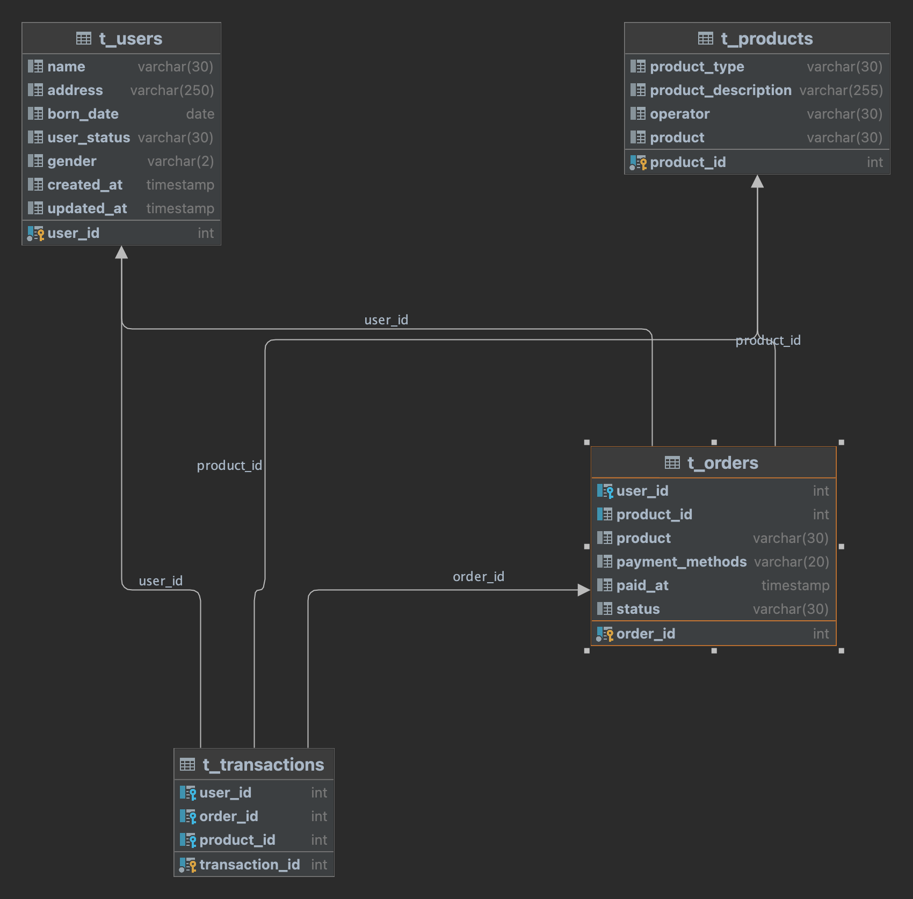

# (12) Database, DDL, DML

## Praktikum 1

Berikut ERD dari requirements yang telah diberikan


## Praktikum 2

1. Untuk membuat database `alta_online_shop` kita menggunakan query berikut
```sql
CREATE DATABASE alta_online_shop;
```
2. Untuk membuat tabel `users` kita menggunakan query berikut:
```sql
create table t_users
(
    user_id     int          not null
        primary key,
    name        varchar(30)  null,
    address     varchar(250) null,
    born_date   date         null,
    user_status varchar(30)  null,
    gender      varchar(2)   null,
    created_at  timestamp    null,
    updated_at  timestamp    null
);
```
3. Untuk membuat tabel `products` kita menggunakan query berikut:
```sql
create table t_products
(
    product_id          int          not null
        primary key,
    product_type        varchar(30)  null,
    product_description varchar(255) null,
    operator            varchar(30)  null,
    product             varchar(30)  null
);
```
4. Untuk membuat tabel `orders` kita menggunakan query berikut:
```sql
create table t_orders
(
    order_id        int         not null
        primary key,
    user_id         int         null,
    product_id      int         null,
    product         varchar(30) null,
    payment_methods varchar(20) null,
    paid_at         timestamp   null,
    status          varchar(30) null,
    constraint t_orders_t_users_null_fk
        foreign key (user_id) references t_users (user_id)
);

create index foreign_key_name
    on t_orders (product_id);
```

5. Untuk membuat tabel `transactions` kita menggunakan query berikut:
```sql
create table t_transactions
(
    transaction_id int not null
        primary key,
    user_id        int null,
    order_id       int null,
    product_id     int null,
    constraint t_transactions_t_orders_null_fk
        foreign key (order_id) references t_orders (order_id),
    constraint t_transactions_t_products_null_fk
        foreign key (product_id) references t_products (product_id),
    constraint t_transactions_t_users_null_fk
        foreign key (user_id) references t_users (user_id)
);
```

6. Untuk membuat tabel `kurir` kita menggunakan query berikut:
```sql
create table t_kurir
(
    id         int       null,
    name       int       null,
    created_at timestamp null,
    updated_at timestamp null
);
```
7. Untuk menambah `column` kita menggunakan query berikut:
```sql
alter table t_kurir
    add ongkos_dasar varchar null;
```

8. Lalu kita rename tabel kurir menjadi shipping sebagai berikut:
```sql
rename table t_kurir to t_shipping;
```
9. lalu kita drop table `shipping` karena tidak dibutuhkan
```sql
drop table shipping;
```
