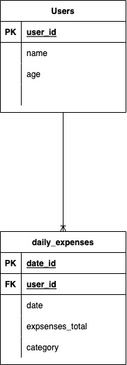
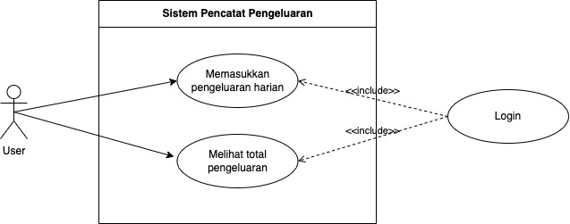

# Praktikum 15

## Membuat ERD
Terdapat dua tabel yaitu tabel `users` yang menyimpan data user dan tabel `daily_expenses` yang menyimpan data pengeluaran harian. Tabel `users` memiliki relasi one-to-many dengan tabel `daily_expenses` dimana satu user dapat memiliki banyak pengeluaran harian. Tabel `daily_expenses` memiliki relasi many-to-one dengan tabel `users` dimana satu pengeluaran harian hanya dapat dimiliki oleh satu user.

## Membuat Use Case
Berikut merupakan gambar dari `use case` yang dibuat.

## Optional
1. Redis
    1. SELECT * FROM users; di redis dapat menggunakan query `KEYS *`
2. Neo4j
    1. SELECT * FROM users; di neo4j dapat menggunakan query `MATCH (n) RETURN n`
3. Cassandra
    1. SELECT * FROM users; di cassandra dapat menggunakan query `SELECT * FROM users;`