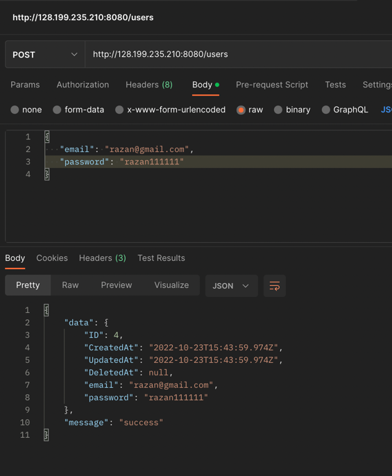
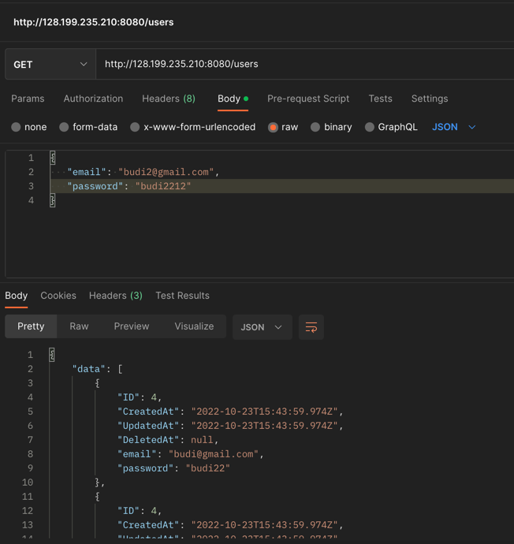

# Praktikum Compute Services

Tugas ini dapat diakses melalui [link Berikut](http://128.199.235.210:8080/).

## Instalasi
Pada praktikum kali ini, saya menjalankan server menggunakan `Ubuntu 22.04` di `Digital Ocean`. Untuk login, saya menggunakan SSH

## Login ke Instances
Saya menggunakan SSH untuk login.
Cara loginnya adalah sebagai berikut:
`ssh username@ip_address`

## Post Data
Berikut ketika program dijalankan dan mengirimkan data ke server.

## Get Data
Berikut ketika program dijalankan dan mengambil data dari server.
