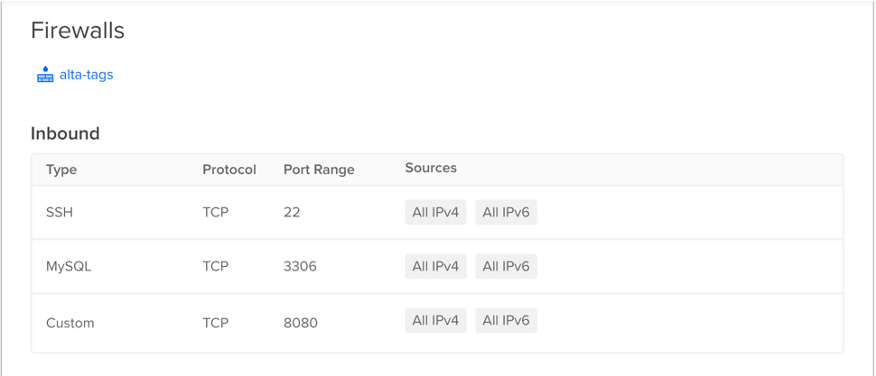
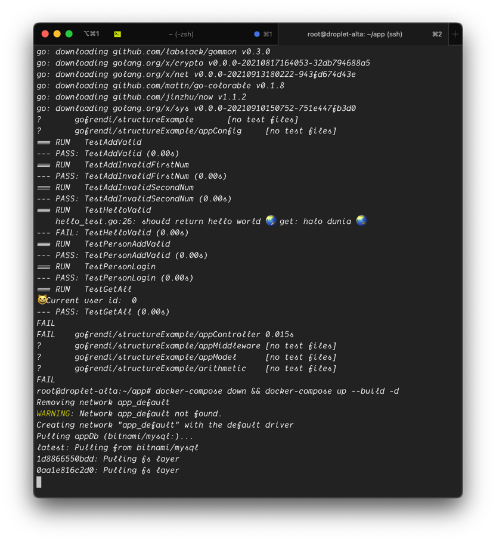
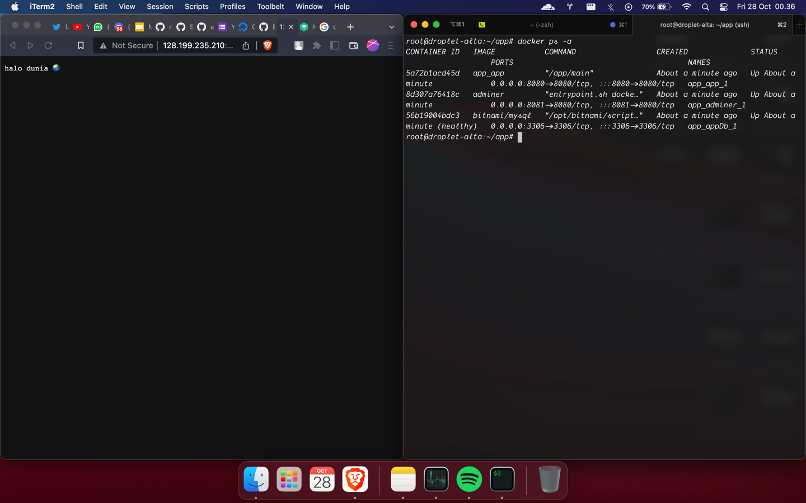
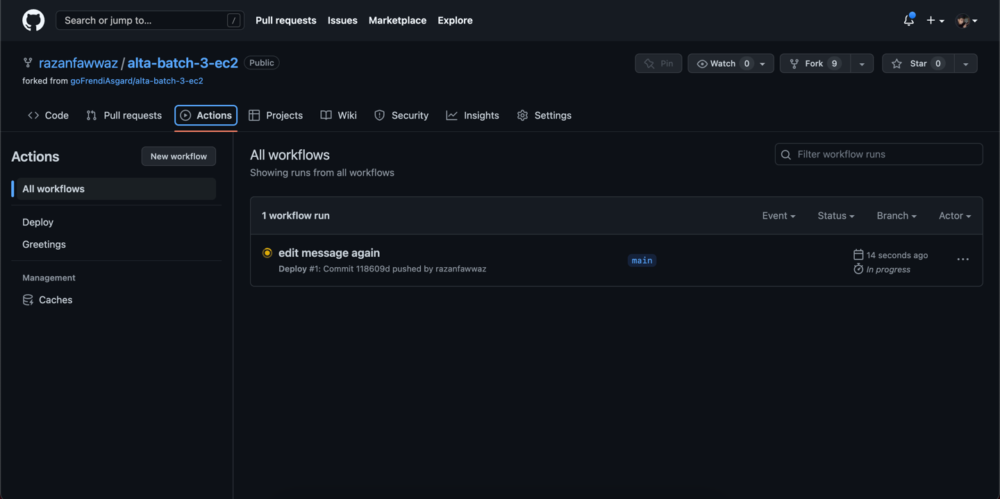
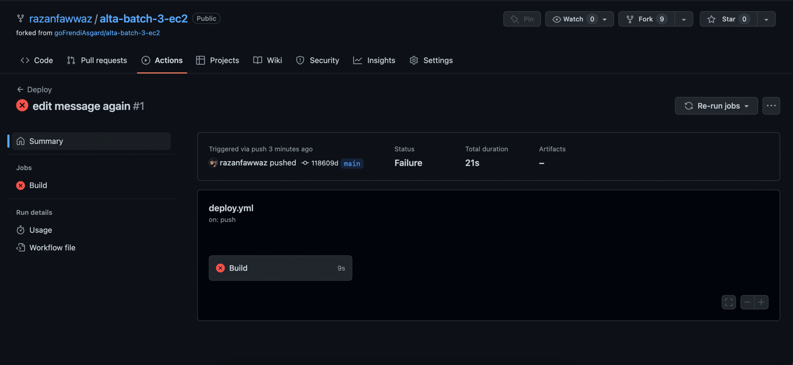
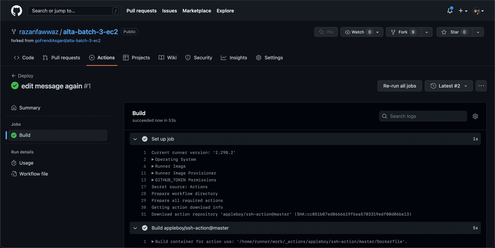
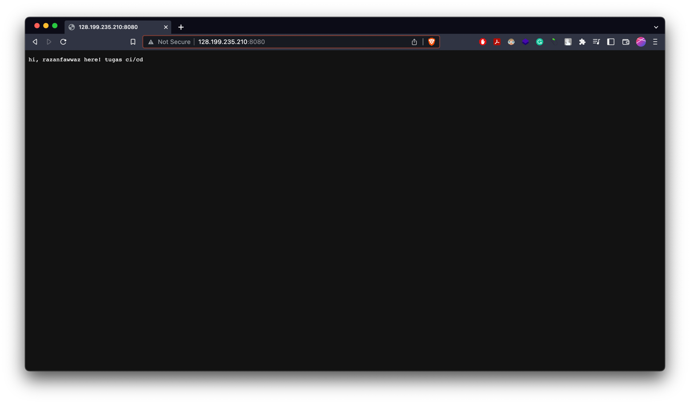

# Praktikum CI/CD

## Intro
Pada praktikum kali ini, saya mendeploy aplikasi `https://github.com/goFrendiAsgard/alta-batch-3-ec2` pada droplets/instances yang saya di Provider Digital Ocean di IP `128.199.235.210`.
Hasil deployment dapat diakses di [sini](http://128.199.235.210:8080/).

## Proses Instalasi
Setup Firewall

Download requirement yang dibutuhkan & build docker

Docker sudah berjalan

## Proses Deployment
Github Actions sudah berjalan ketika ada trigger 

Github Actions gagal karena ada kesalahan autentikasi

Github Actions berhasil dan sudah di deploy

## Hasil Deployment
Yang awalnya memiliki output `Hello World!` menjadi `hi, razanfawwaz here! tugas ci/cd`
