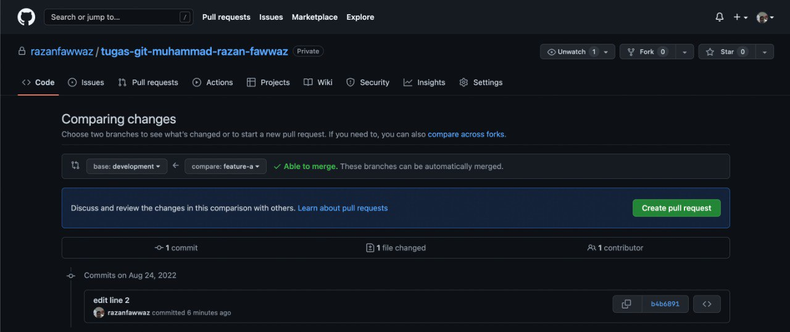
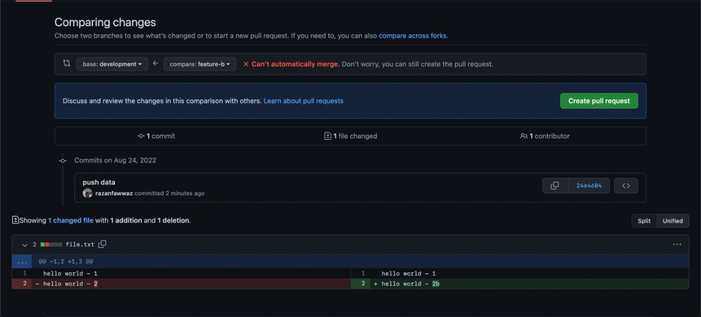
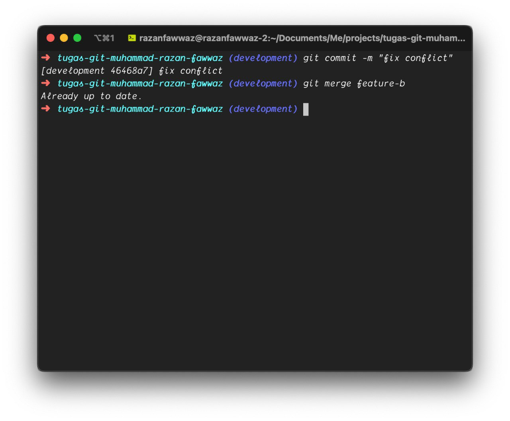

# Tugas Git

Tugas telah dikerjakan di sebuah repo baru [link repo](https://github.com/razanfawwaz/tugas-git-muhammad-razan-fawwaz).

Pada gambar di bawah ini terlihat `feature-a` tidak memiliki masalah ketika akan dimerge.

Ketika `feature-a` berhasil dimerge lalu ingin merge `feature-b` ke dalam `development` maka akan terjadi conflict.

Setelah conflict diselesaikan, `feature-b` berhasil dimerge.

