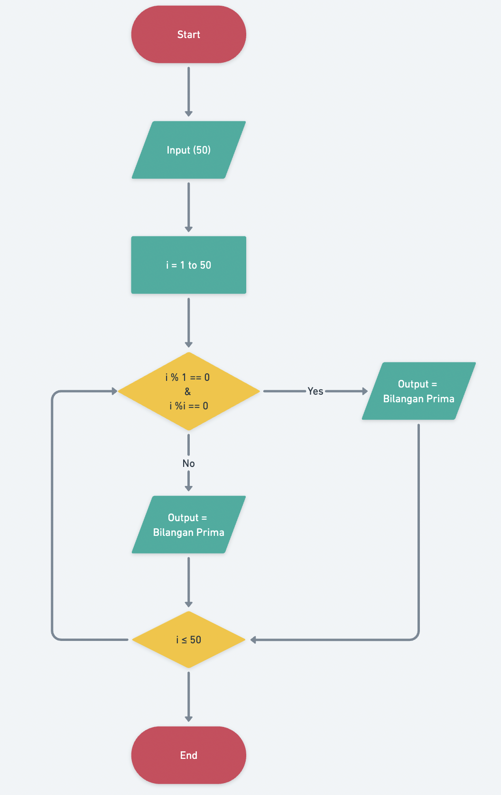
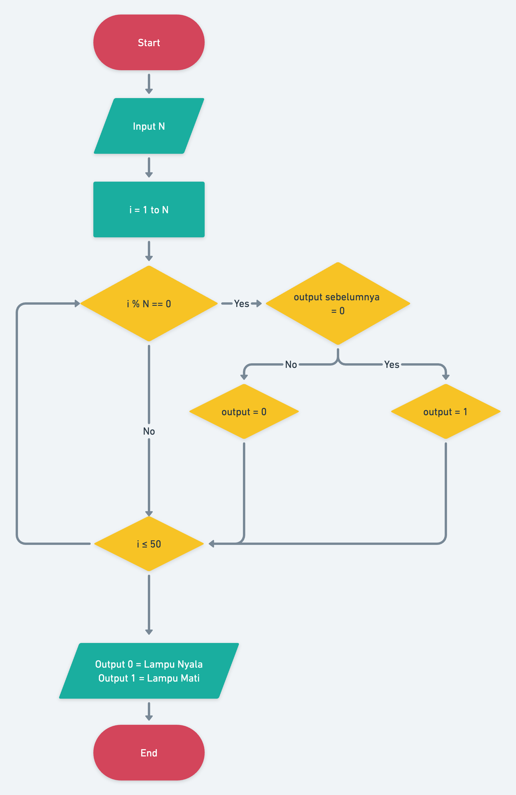
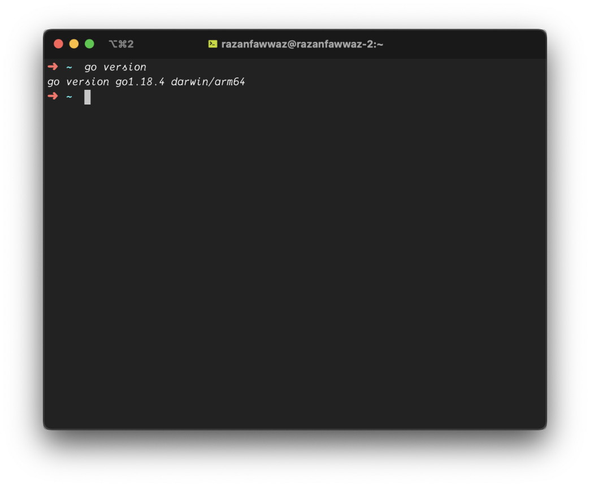
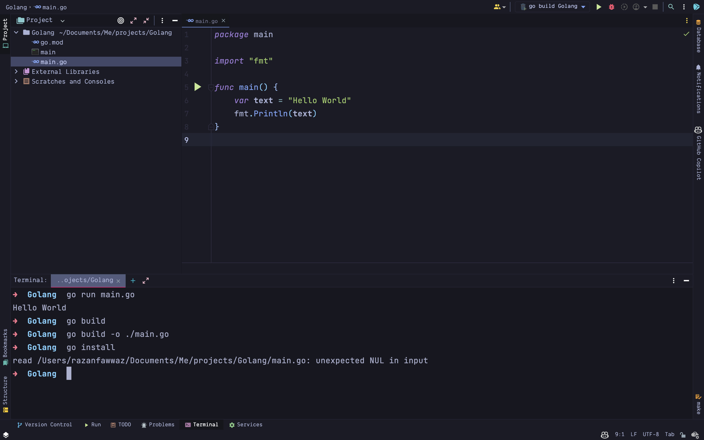

# Tugas: Introduction to Algorithm and Golang

26 Agustus 2022.

## Problem 1
1. Pada problem 1 diminta untuk membuat flowchart untuk menentukan bilangan prima atau bukan.

    Jika dilihat dari gambar di bawah ini, maka dapat dikatakan bahwa tahapan yang akan dilakukan seperti berikut: 
    1. Program dimulai
    2. Membaca input
    3. Akan masuk ke dalam sebuah `looping`
    4. Jika `i%1 == 0` dan `i%i != 0`, maka i adalah bilangan prima.
    5. Jika i <= 50 maka akan mengulang kembali ke dalam looping.

`terdapat kesalahan pada output pada gambar di bawah ini, seharusnya pada output = Bukan Bilangan Prima.`

## Problem 2
2. Pada problem 2 ini diminta untuk membuat flowchart pada kasus saklar lampu. 
    1. Program dimulai
    2. Membaca input
    3. Akan masuk ke dalam sebuah `looping`
    4. Jika `i%n == 0` & output sebelumnya = 0 maka output akan menjadi 1. Jika tidak maka output akan menjadi 0.
    6. Program akan mengeluarkan output, jika output = 0 maka lampu nyala, jika output = 1 maka lampu mati.

## Problem 3
Golang terlah berhasil diinstall di komputer.

## Problem 4
Mencetak hello world
