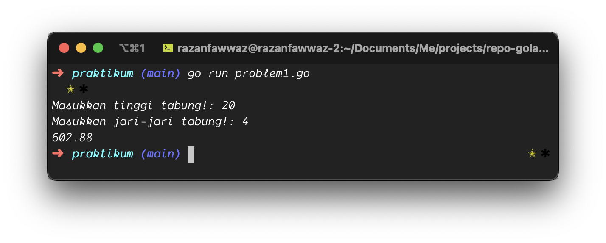
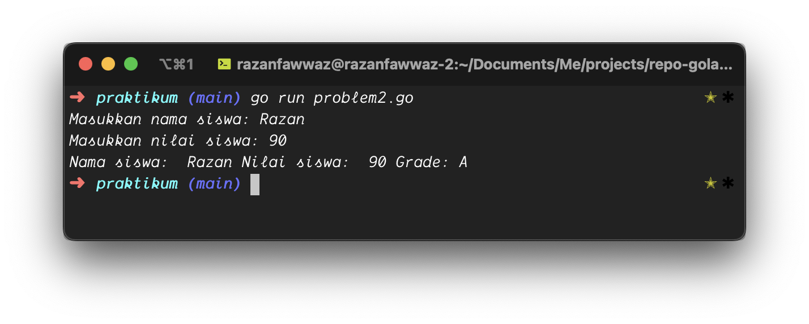
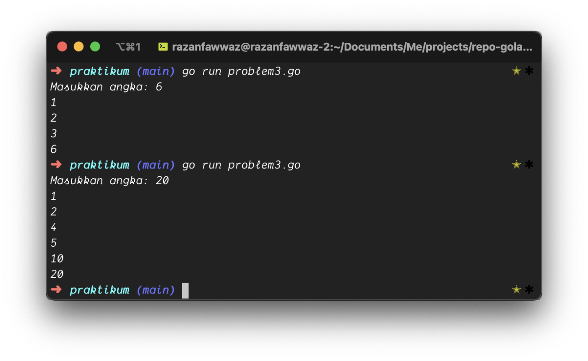
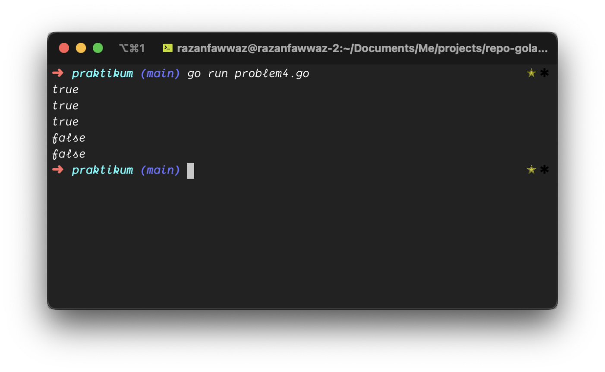
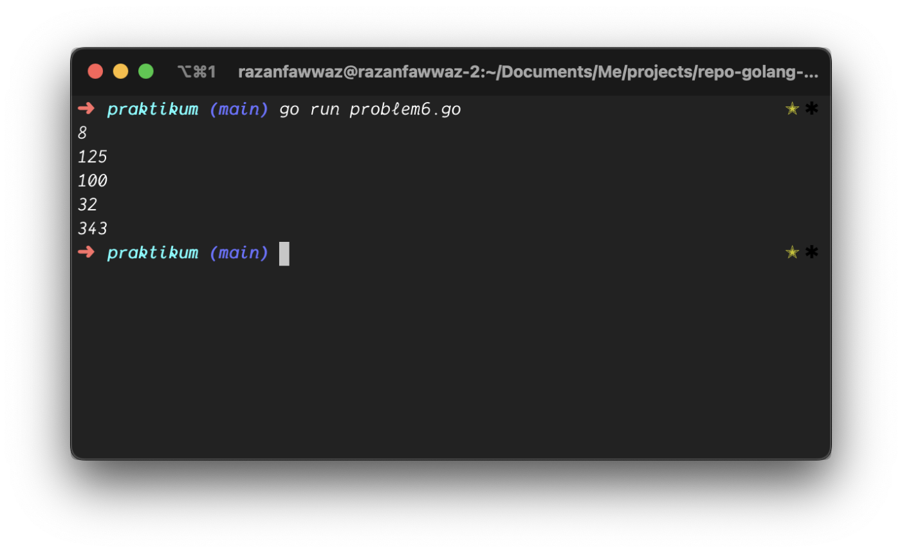
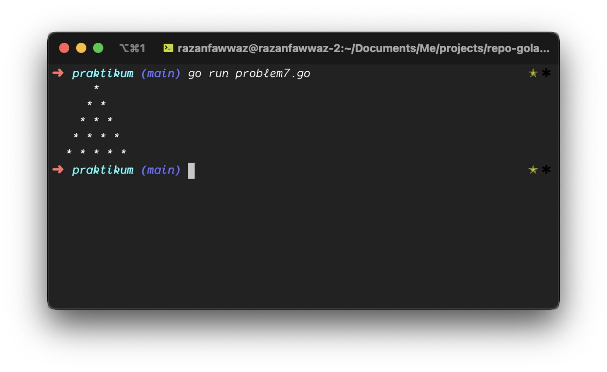
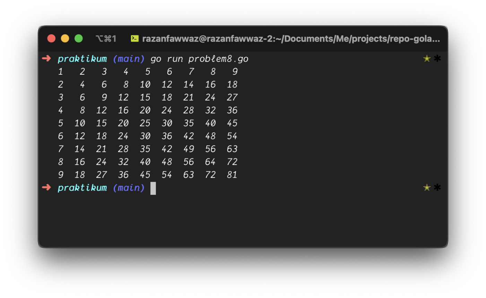

# Tugas Basic Programming

Berikut merupakan screenshot dari hasil kode yang dijalankan.
### Problem 1

### Problem 2

### Problem 3

### Problem 4

### Problem 5

### Problem 6

### Problem 7

### Problem 8

